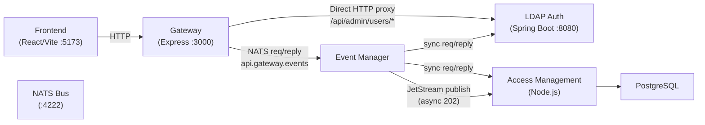
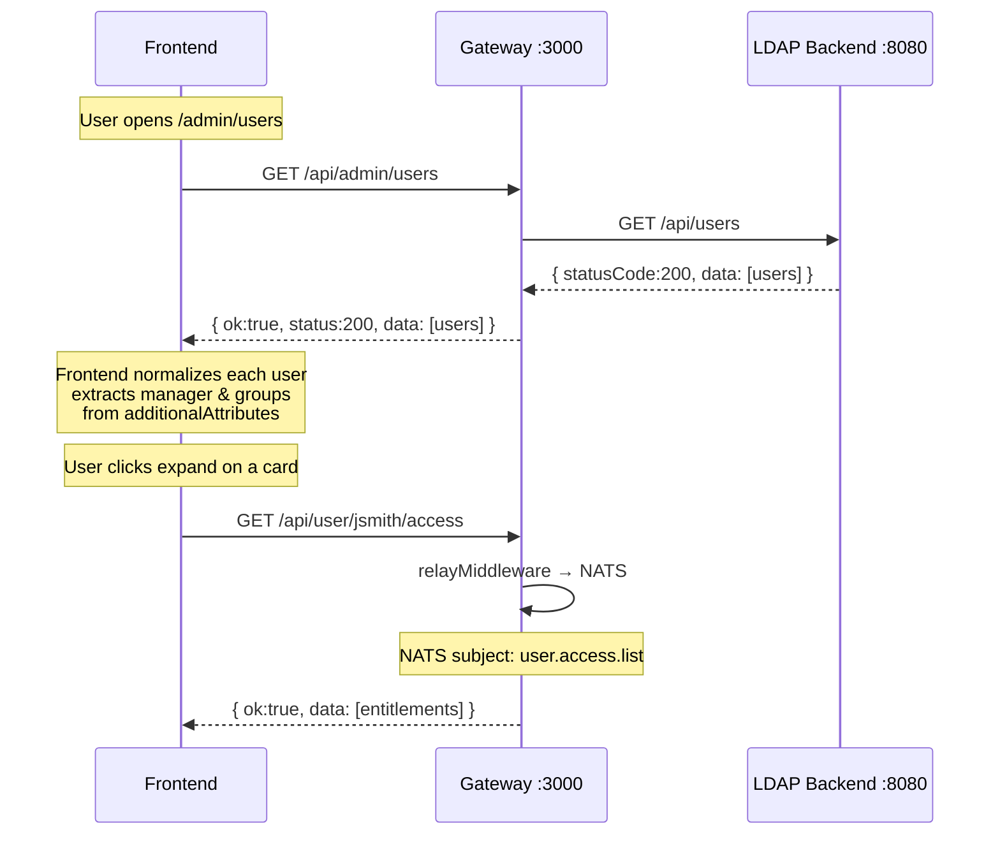
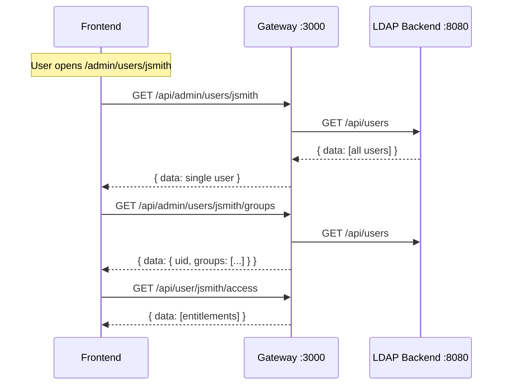

# Admin User Management — API Specification

> **Purpose**: This document describes the complete data flow for the Admin User Management feature, covering Frontend → Gateway → NATS → Backend services. Share this with backend teams so they know exactly what endpoints to implement, what NATS channels to listen on, and what request/response shapes to use.

---

## Architecture Overview



---

## Standard Response Envelope

All responses across the system follow the **ServiceReply** schema:

```json
{
  "ok": true,
  "status": 200,
  "message": "Descriptive message",
  "data": { },
  "requestId": "uuid (only on 202 async)"
}
```

Error responses:
```json
{
  "ok": false,
  "status": 404,
  "message": "User not found"
}
```

---

## 1. Admin Users — Gateway Direct Proxy Routes

These routes are handled directly by the Gateway (no NATS relay). The Gateway proxies HTTP requests to the LDAP backend at `http://18.60.129.12:8080`.

> [!IMPORTANT]
> **Changes already made**: Gateway router file created at `gateway/src/router/admin/users.js` and registered in `app.js` at mount path `/api/admin/users`.

---

### 1.1 List All Users

| Layer | Detail |
|-------|--------|
| **Frontend calls** | `GET /api/admin/users` |
| **Gateway route** | `GET /api/admin/users/` → proxy to LDAP backend |
| **LDAP Backend hit** | `GET http://18.60.129.12:8080/api/users` |
| **NATS subject** | _None (direct HTTP proxy)_ |
| **Audit subject** | `events.audit.admin.users` |

**Request** (query params — optional):
```
GET /api/admin/users?search=john&role=admin&status=ACTIVE
```

**LDAP Backend Response** (current shape):
```json
{
  "statusCode": 200,
  "message": "Users fetched successfully",
  "data": [
    {
      "uid": "jsmith",
      "cn": "John Smith",
      "sn": "Smith",
      "givenName": "John",
      "mail": "john.smith@company.com",
      "additionalAttributes": {
        "manager": "uid=mjones,ou=users,dc=example,dc=com",
        "memberOf": "cn=Engineering,ou=groups,dc=example,dc=com;cn=DevOps,ou=groups,dc=example,dc=com",
        "department": "Engineering",
        "role": "admin"
      }
    }
  ]
}
```

**Gateway normalised response** (what Frontend receives):
```json
{
  "ok": true,
  "status": 200,
  "message": "Users fetched",
  "data": [
    {
      "uid": "jsmith",
      "cn": "John Smith",
      "sn": "Smith",
      "givenName": "John",
      "mail": "john.smith@company.com",
      "additionalAttributes": { "..." }
    }
  ]
}
```

**Frontend normalises to**:
```typescript
{
  id: "jsmith",
  uid: "jsmith",
  full_name: "John Smith",
  email: "john.smith@company.com",
  role: "admin",
  manager: "mjones",        // extracted from additionalAttributes.manager
  groups: ["Engineering", "DevOps"],  // extracted from additionalAttributes.memberOf
  // ...raw fields preserved
}
```

---

### 1.2 Get Single User

| Layer | Detail |
|-------|--------|
| **Frontend calls** | `GET /api/admin/users/:uid` |
| **Gateway route** | `GET /api/admin/users/:uid` → fetches all users, filters by uid |
| **LDAP Backend hit** | `GET http://18.60.129.12:8080/api/users` |
| **NATS subject** | _None_ |

**Request**:
```
GET /api/admin/users/jsmith
```

**Response**:
```json
{
  "ok": true,
  "status": 200,
  "message": "User fetched",
  "data": {
    "uid": "jsmith",
    "cn": "John Smith",
    "sn": "Smith",
    "givenName": "John",
    "mail": "john.smith@company.com",
    "additionalAttributes": { "..." }
  }
}
```

> [!TIP]
> **Backend improvement opportunity**: Add a dedicated `GET /api/users/:uid` endpoint on the LDAP backend to avoid fetching all users and filtering. This would improve performance significantly.

---

### 1.3 Get User Groups

| Layer | Detail |
|-------|--------|
| **Frontend calls** | `GET /api/admin/users/:uid/groups` |
| **Gateway route** | `GET /api/admin/users/:uid/groups` → extracts from `additionalAttributes.memberOf` |
| **LDAP Backend hit** | `GET http://18.60.129.12:8080/api/users` |
| **NATS subject** | _None_ |

**Request**:
```
GET /api/admin/users/jsmith/groups
```

**Response**:
```json
{
  "ok": true,
  "status": 200,
  "message": "Groups fetched",
  "data": {
    "uid": "jsmith",
    "groups": ["Engineering", "DevOps"]
  }
}
```

> [!IMPORTANT]
> **Backend endpoint needed**: The LDAP backend should expose a dedicated `GET /api/users/:uid/groups` endpoint that queries LDAP for `(&(objectClass=groupOfUniqueNames)(uniqueMember=uid=:uid,ou=users,dc=example,dc=com))`. Currently the gateway parses `additionalAttributes.memberOf` which requires the LDAP schema to expose `memberOf` as a user attribute.

---

### 1.4 Add User to Group

| Layer | Detail |
|-------|--------|
| **Frontend calls** | `POST /api/admin/users/:uid/group` |
| **Gateway route** | Proxies to LDAP backend |
| **LDAP Backend hit** | `POST http://18.60.129.12:8080/api/adduser/group` |
| **NATS subject** | _None_ |

**Request**:
```json
POST /api/admin/users/jsmith/group
{
  "groupCn": "Engineering"
}
```

**Response**:
```json
{
  "ok": true,
  "status": 200,
  "message": "User added to group successfully"
}
```

**Error responses**:
| Status | Message |
|--------|---------|
| 404 | User not found |
| 404 | Group not found |
| 409 | User already in group |

---

### 1.5 Remove User from Group

| Layer | Detail |
|-------|--------|
| **Frontend calls** | `DELETE /api/admin/users/:uid/group` |
| **Gateway route** | Proxies to LDAP backend |
| **LDAP Backend hit** | `POST http://18.60.129.12:8080/api/removeuser/group` |
| **NATS subject** | _None_ |

**Request**:
```json
DELETE /api/admin/users/jsmith/group
{
  "groupCn": "Engineering"
}
```

**Response**:
```json
{
  "ok": true,
  "status": 200,
  "message": "User removed from group successfully"
}
```

---

## 2. User Management — NATS Relay Routes (Existing)

These routes use the Gateway's `relayMiddleware` → NATS `api.gateway.events` → Event Manager → downstream service.

---

### 2.1 Get Current User Profile

| Layer | Detail |
|-------|--------|
| **Frontend calls** | `GET /api/user/me` |
| **Gateway route** | `relayMiddleware` |
| **NATS subject** | `user.me` (sync) |
| **Event Manager** | Request/reply to `user.me` |

**GatewayEnvelope sent**:
```json
{
  "requestId": "uuid",
  "userId": "from-jwt",
  "role": "admin",
  "method": "GET",
  "path": "/api/user/me",
  "body": {},
  "query": {},
  "params": {},
  "timestamp": 1714920000000
}
```

**Expected ServiceReply**:
```json
{
  "ok": true,
  "status": 200,
  "data": {
    "id": "jsmith",
    "full_name": "John Smith",
    "email": "john@company.com",
    "role": "admin"
  }
}
```

---

### 2.2 List Users (Legacy relay)

| Layer | Detail |
|-------|--------|
| **Frontend calls** | _No longer used — replaced by `/api/admin/users`_ |
| **Gateway route** | `GET /api/user/` → `relayMiddleware` |
| **NATS subject** | `user.list` (sync) |

> [!NOTE]
> The admin frontend now uses `/api/admin/users` (direct proxy). The `user.list` NATS subject is still available for other consumers.

---

### 2.3 Get User by ID

| Layer | Detail |
|-------|--------|
| **Frontend calls** | _Replaced by `/api/admin/users/:uid`_ |
| **Gateway route** | `GET /api/user/:id` → `relayMiddleware` |
| **NATS subject** | `user.get` (sync) |

---

### 2.4 Update User Role

| Layer | Detail |
|-------|--------|
| **Frontend calls** | `PUT /api/user/:id/role` |
| **Gateway route** | `relayMiddleware` |
| **NATS subject** | `events.user.role.update` (async → JetStream) |
| **JetStream stream** | `EVENTS_AUTH` |

**Request body**:
```json
{
  "role": "supervisor"
}
```

**Response** (immediate 202):
```json
{
  "ok": true,
  "status": 202,
  "message": "Accepted – processing asynchronously",
  "requestId": "uuid"
}
```

> [!IMPORTANT]
> **Backend consumer needed**: A service must subscribe to `events.user.role.update` on the `EVENTS_AUTH` stream, decode the GatewayEnvelope, extract `envelope.params.id` and `envelope.body.role`, then update the user's role in LDAP and/or PostgreSQL.

---

### 2.5 Deactivate User

| Layer | Detail |
|-------|--------|
| **Frontend calls** | `PUT /api/user/:id/deactivate` |
| **Gateway route** | `relayMiddleware` |
| **NATS subject** | `events.user.deactivate` (async → JetStream) |
| **JetStream stream** | `EVENTS_AUTH` |

**Response** (immediate 202):
```json
{
  "ok": true,
  "status": 202,
  "message": "Accepted – processing asynchronously",
  "requestId": "uuid"
}
```

---

### 2.6 Get User Access / Entitlements

| Layer | Detail |
|-------|--------|
| **Frontend calls** | `GET /api/user/:id/access` |
| **Gateway route** | `relayMiddleware` |
| **NATS subject** | `user.access.list` (sync) |

**Expected ServiceReply**:
```json
{
  "ok": true,
  "status": 200,
  "data": [
    {
      "id": "uuid",
      "user_id": "jsmith",
      "user_name": "John Smith",
      "application_id": "app-1",
      "application_name": "SAP",
      "role_id": "role-1",
      "role_name": "Viewer",
      "granted_at": "2025-01-15T10:00:00Z",
      "expires_at": null,
      "status": "ACTIVE"
    }
  ]
}
```

> [!IMPORTANT]
> **Access Management service** must subscribe to `user.access.list` (NATS Core) and respond with the user's active entitlements from PostgreSQL. The service already handles `access.request.list` — add a similar handler for `user.access.list` that queries by `user_id`.

---

## 3. NATS Subjects — Complete Reference

### Sync Subjects (Core NATS — request/reply)

| Subject | Method | Path Pattern | Handler Service |
|---------|--------|-------------|-----------------|
| `auth.login` | POST | `/api/user/login` | Auth Service |
| `auth.register` | POST | `/api/user/register` | Auth Service |
| `auth.logout` | POST | `/api/user/logout` | Auth Service |
| `auth.refresh` | POST | `/api/user/refresh` | Auth Service |
| `user.me` | GET | `/api/user/me` | Auth Service |
| `user.password.change` | PUT | `/api/user/password` | Auth Service |
| `user.list` | GET | `/api/user` | Auth Service |
| `user.get` | GET | `/api/user/:id` | Auth Service |
| `user.access.list` | GET | `/api/user/:id/access` | **Access Management** |
| `access.request.list` | GET | `/api/access/request` | Access Management |
| `access.request.get` | GET | `/api/access/request/:id` | Access Management |
| `access.request.create` | POST | `/api/access/request` | Access Management |
| `access.time.list` | GET | `/api/access/time` | Access Management |
| `access.time.get` | GET | `/api/access/time/:id` | Access Management |
| `roles.list` | GET | `/api/roles` | Access Management |
| `roles.get` | GET | `/api/roles/:id` | Access Management |
| `permissions.list` | GET | `/api/permissions` | Access Management |
| `applications.list` | GET | `/api/applications` | Access Management |
| `applications.get` | GET | `/api/applications/:id` | Access Management |
| `applications.roles.list` | GET | `/api/applications/:id/roles` | Access Management |
| `recommendation.get` | GET | `/api/recommendation/:id` | Recommendation Service |
| `audit.log.query` | GET | `/api/audit/log` | Audit Service |

### Async Subjects (JetStream — publish only, 202 response)

| Subject | Stream | Method | Path Pattern | Consumer Service |
|---------|--------|--------|-------------|-----------------|
| `events.user.creation.register` | EVENTS_USER_CREATION | POST | `/api/user/register` | Auth Service |
| `events.user.role.update` | EVENTS_AUTH | PUT | `/api/user/:id/role` | **Auth Service (needs consumer)** |
| `events.user.deactivate` | EVENTS_AUTH | PUT | `/api/user/:id/deactivate` | **Auth Service (needs consumer)** |
| `events.provision.bulk` | EVENTS_PROVISION | POST | `/api/user/upload/create/submit` | Provisioning Worker |
| `events.provision.single` | EVENTS_PROVISION | POST | `/api/user/provision` | Provisioning Worker |
| `events.deprovision.user` | EVENTS_PROVISION | DELETE | `/api/user/deprovision/:id` | Provisioning Worker |
| `events.access.request.update` | EVENTS_ACCESS | PUT | `/api/access/request/:id` | Access Management |
| `events.access.time.create` | EVENTS_ACCESS | POST | `/api/access/time` | Access Management |
| `events.access.time.revoke` | EVENTS_ACCESS | DELETE | `/api/access/time/:id` | Access Management |
| `events.access.cert.campaign` | EVENTS_ACCESS | POST | `/api/access/cert/campaign` | Certification Service |
| `events.access.cert.decision` | EVENTS_ACCESS | PUT | `/api/access/cert/decision` | Certification Service |
| `events.recommendation.run` | EVENTS_RECOMMENDATION | POST | `/api/recommendation/run` | Recommendation Service |
| `events.audit.report` | EVENTS_AUDIT | POST | `/api/audit/report` | Audit Service |
| `events.roles.create` | EVENTS_AUTH | POST | `/api/roles` | Access Management |
| `events.roles.update` | EVENTS_AUTH | PUT | `/api/roles/:id` | Access Management |
| `events.applications.create` | EVENTS_AUTH | POST | `/api/applications` | Access Management |

### Audit Subjects (JetStream — fire-and-forget by Event Manager)

| Subject | Triggered By |
|---------|-------------|
| `events.audit.auth` | Login, logout, register, refresh |
| `events.audit.admin.users` | **Admin user management operations (NEW)** |
| `events.audit.provision` | Provision, deprovision |
| `events.audit.access` | Generic access operations |
| `events.audit.access.cert` | Certification campaigns |
| `events.audit.access.time` | Time-based access |
| `events.audit.recommendation` | Recommendation engine |
| `events.audit.general` | Everything else |

---

## 4. JetStream Streams

| Stream Name | Subjects | Retention | TTL |
|------------|----------|-----------|-----|
| `EVENTS_AUTH` | `events.auth.*` | Workqueue | 1 hour |
| `EVENTS_USER_CREATION` | `events.user.creation.*` | Workqueue | 1 hour |
| `EVENTS_PROVISION` | `events.provision.*`, `events.deprovision.*` | Workqueue | 24 hours |
| `EVENTS_ACCESS` | `events.access.request.*`, `events.access.time.*`, `events.access.cert.*` | Workqueue | 24 hours |
| `EVENTS_RECOMMENDATION` | `events.recommendation.*` | Workqueue | 24 hours |
| `EVENTS_AUDIT` | `events.audit.>` _(multi-level)_ | Limits | 30 days |
| `USER_NOTIFY` | `user.notify.*` | Limits (Memory) | 5 minutes |

---

## 5. Backend Endpoints Required from LDAP-Auth Service

> [!WARNING]
> These are endpoints that the **LDAP backend (Spring Boot :8080)** must expose or already exposes. Items marked 🟢 exist, items marked 🔴 need to be created.

| Status | Method | Endpoint | Purpose |
|--------|--------|----------|---------|
| 🟢 | GET | `/api/users` | List all users |
| 🔴 | GET | `/api/users/:uid` | Get single user by UID |
| 🔴 | GET | `/api/users/:uid/groups` | List groups user belongs to |
| 🟢 | POST | `/api/adduser/group` | Add user to LDAP group |
| 🟢 | POST | `/api/removeuser/group` | Remove user from LDAP group |
| 🟢 | POST | `/api/provision/users` | Bulk create users |
| 🟢 | POST | `/api/deprovision/user` | Delete user |
| 🟢 | POST | `/api/update/users` | Bulk update users |
| 🟢 | POST | `/api/login` | Authenticate |
| 🟢 | POST | `/api/create/group` | Create LDAP group |

### 5.1 `GET /api/users/:uid` — Needed

**What to implement in `AuthController.java`**:

```java
@GetMapping("/users/{uid}")
public ResponseEntity<ApiResponse> getUserByUid(@PathVariable String uid) {
    // Query LDAP: search ou=users,dc=example,dc=com with filter (uid=:uid)
    // Return single UserResponse with additionalAttributes
}
```

**Expected response**:
```json
{
  "statusCode": 200,
  "message": "User fetched",
  "data": {
    "uid": "jsmith",
    "cn": "John Smith",
    "sn": "Smith",
    "givenName": "John",
    "mail": "john@company.com",
    "additionalAttributes": {
      "manager": "uid=mjones,ou=users,dc=example,dc=com",
      "memberOf": "cn=Engineering,ou=groups,dc=example,dc=com",
      "role": "admin"
    }
  }
}
```

### 5.2 `GET /api/users/:uid/groups` — Needed

**What to implement in `LdapAuthService.java`**:

```java
public List<String> getUserGroups(String uid) {
    // LDAP search: base = "ou=groups,dc=example,dc=com"
    //              filter = "(&(objectClass=groupOfUniqueNames)(uniqueMember=uid={uid},ou=users,dc=example,dc=com))"
    // Extract cn from each result
    // Return list of group CNs
}
```

**Controller**:
```java
@GetMapping("/users/{uid}/groups")
public ResponseEntity<GetUserGroupsResponse> getUserGroups(@PathVariable String uid) {
    List<String> groups = ldapAuthService.getUserGroups(uid);
    return ResponseEntity.ok(new GetUserGroupsResponse(200, "Groups fetched", uid, groups));
}
```

**Expected response**:
```json
{
  "statusCode": 200,
  "message": "Groups fetched",
  "data": {
    "uid": "jsmith",
    "groups": ["Engineering", "DevOps", "Admins"]
  }
}
```

### 5.3 Ensure `additionalAttributes` includes `manager`

In `LdapAuthService.getAllUsers()`, the `additionalAttributes` map currently skips only `uid`, `cn`, `sn`, `givenName`, `mail`, `objectClass`, `userPassword`. Make sure `manager` is NOT skipped — it should flow through in `additionalAttributes`.

If users in LDAP don't have a `manager` attribute, it needs to be added when provisioning users. The CSV provisioner already sends `manager` as an additional attribute:

```javascript
// gateway/src/router/provision/prov.js — toLdapUser()
{
  manager: r.manager_id?.trim() || null,
}
```

---

## 6. Backend — Access Management NATS Handlers Needed

> [!WARNING]
> These are NATS subjects that the **Access Management service** needs to handle. Items marked 🟢 exist, items marked 🔴 need to be created.

| Status | Subject | Mode | Purpose |
|--------|---------|------|---------|
| 🟢 | `access.request.list` | sync | List access requests |
| 🟢 | `access.request.get` | sync | Get single request |
| 🟢 | `access.request.create` | sync | Create access request |
| 🟢 | `access.time.list` | sync | List time-based access |
| 🟢 | `access.time.get` | sync | Get time-based access |
| 🟢 | `events.access.request.update` | async | Approve/reject request |
| 🟢 | `events.access.time.create` | async | Create time access |
| 🟢 | `events.access.time.revoke` | async | Revoke time access |
| 🔴 | `user.access.list` | sync | **Get user's entitlements by user_id** |

### 6.1 `user.access.list` Handler — Needed

Subscribe to `user.access.list` (NATS Core) in `access-management/src/index.js`.

**GatewayEnvelope received**:
```json
{
  "requestId": "uuid",
  "userId": "admin-user-id",
  "role": "admin",
  "method": "GET",
  "path": "/api/user/jsmith/access",
  "body": {},
  "query": {},
  "params": { "id": "jsmith" },
  "timestamp": 1714920000000
}
```

**Handler logic**:
```javascript
// Extract target user id from path: /api/user/:id/access
const targetUserId = envelope.path.split("/")[3]; // "jsmith"

// Query PostgreSQL:
const { rows } = await db.query(
  `SELECT ar.id, ar.user_id, ar.application_id, ar.application_name,
          ar.role_id, ar.role_name, ar.submitted_at AS granted_at,
          ar.expires_at, ar.status
   FROM access_requests ar
   WHERE ar.user_id = $1 AND ar.status IN ('APPROVED', 'PROVISIONED')
   ORDER BY ar.submitted_at DESC`,
  [targetUserId]
);
```

**Expected ServiceReply**:
```json
{
  "ok": true,
  "status": 200,
  "data": [
    {
      "id": "uuid",
      "user_id": "jsmith",
      "user_name": "John Smith",
      "application_id": "app-1",
      "application_name": "SAP ERP",
      "role_id": "role-1",
      "role_name": "Viewer",
      "granted_at": "2025-01-15T10:00:00Z",
      "expires_at": null,
      "status": "ACTIVE"
    }
  ]
}
```

---

## 7. Changes Already Made (Gateway + Frontend)

### Gateway Changes

| File | Change |
|------|--------|
| `gateway/src/router/admin/users.js` | **NEW** — Admin users proxy router (5 routes) |
| `gateway/src/app.js` | Added import + `app.use("/api/admin/users", adminUsersRouter)` |
| `gateway/event-manager/index.js` | Added `events.audit.admin.users` audit subject |
| `gateway/event-manager/streams.js` | Changed `EVENTS_AUDIT` subjects from `events.audit.*` to `events.audit.>` |

### Frontend Changes

| File | Change |
|------|--------|
| `src/api/users.api.ts` | **REWRITTEN** — All calls routed through gateway (`/api/admin/users`), added `manager`, `groups` to User type |
| `src/features/user-management/UserListPage.tsx` | **REWRITTEN** — Expandable user cards showing manager, groups, access |
| `src/features/user-management/UserDetailPage.tsx` | **REWRITTEN** — 3-column grid: Profile + Manager + Groups, access table below |
| `src/index.css` | Added ~320 lines of CSS for user cards, role badges, detail grid |

---

## 8. Data Flow Diagram — Admin User Page




